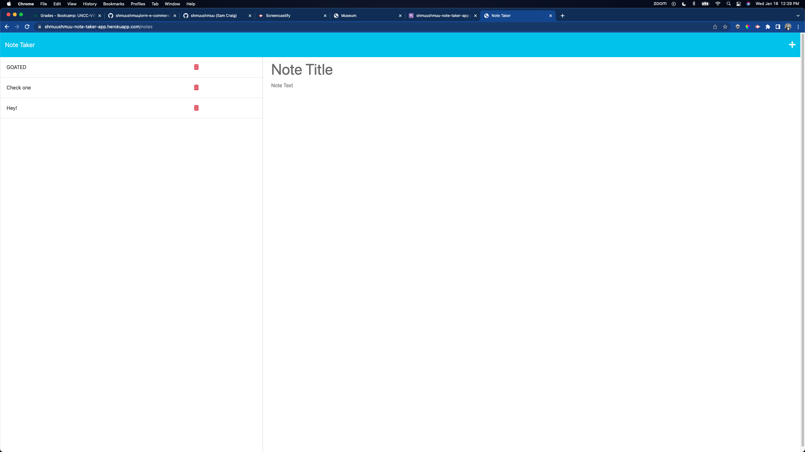

# note-taker-app
  
  [!Deployed-site](https://shmuushmuu-note-taker-app.herokuapp.com/)

  ## Description of Project
  This app deploys a page where you can store and dete notes for yourself in a clean, organized space. Give your note a title, fill in the content, and save it. It will populate on the left side of the screen! If you no longer need the note, you can delete it.

  ## Table of Contents
  - [Installation Instructions](#installation-instructions)
  - [License](#license)
  - [Images](#Images)
  - [Questions](#questions)
   
  ## Installation Instructions
  Run npm install, and start the app through express in your terminal by running node index.js
    
  ## License
  MIT

  ## Images
  Here is a screenshot of the deployed site:
  

  ## Questions
  Please feel free to reach out to me directly at samfcraig@gmail.com, or you can find this project and others at my GitHub account, https://github.com/shmuushmuu.
  